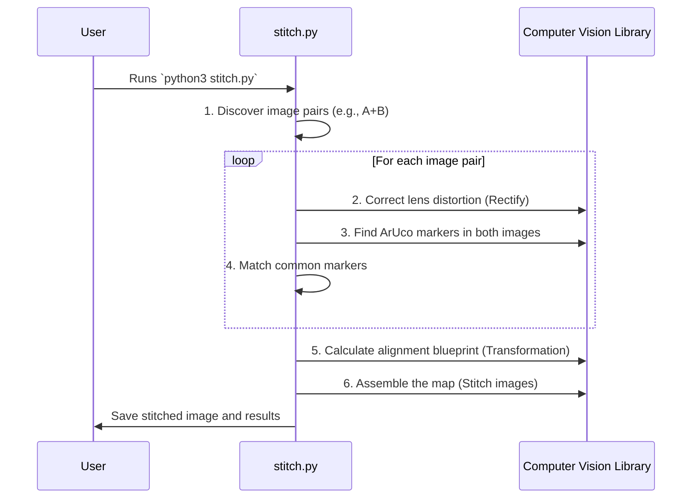

# Chapter 1: Offline Stitching & Calibration Script (Python)

Welcome to the `stitchmrsl` project! If you've ever wondered how panorama photos are made or how multiple video feeds can be combined into one large, seamless view, you've come to the right place. Our journey starts with the very first, and most fundamental, tool in our toolkit.

### What's Our Goal?

Imagine you have three cameras set up side-by-side, each pointing slightly differently to capture a wide scene.

*   Camera A (Left) sees the left part of the scene.
*   Camera B (Middle) sees the middle part.
*   Camera C (Right) sees the right part.

There are overlaps: Camera A and B see some of the same things, and so do Camera B and C. Our goal is to write a program that can automatically "glue" these images together to create one giant, cohesive picture.

This chapter introduces the Python script that does exactly that. Think of it as a master cartographer's workbench. Before a cartographer can assemble a large world map from smaller regional maps, they first need to find common landmarks to figure out exactly how the pieces align. Our script does the same thing, but with images and special markers.

### The Core Idea: Stitching with ArUco Markers

How does the script know how to align the images? It uses special, easy-to-detect landmarks called **ArUco markers**. They are simple black and white squares that look like a simplified QR code.


By placing a calibration pattern with many of these markers in front of our cameras, we give the script a clear set of common reference points. It can then say, "Aha! Marker #23 is at *this* position in the left image and at *that* position in the middle image. Now I can calculate how to rotate and shift the left image to match the middle one."

### A Step-by-Step Guide to Using the Script

This Python script, `stitch.py`, is a command-line tool. It reads your images, performs all the calculations, and saves the results.

#### 1. Your Input: What the Script Needs

The script needs two things:

1.  **A Calibration File (`buena.json`):** Our cameras have fisheye lenses, which distort images (like looking through a peephole). This file contains the "prescription" to correct that distortion for each camera.

    ```json
    // Inside buena.json (simplified)
    {
      "cameras": {
        "izquierda": { "K": [...], "dist": [...] },
        "central": { "K": [...], "dist": [...] },
        "derecha": { "K": [...], "dist": [...] }
      }
    }
    ```

2.  **Folders of Overlapping Images:** You need to organize your captured images into a specific folder structure. The script looks for overlaps between camera A ("izquierda") and B ("central"), and between B ("central") and C ("derecha").

    ```text
    stereo_images/
    ├── AB_overlap/
    │   ├── central/
    │   │   └── frame_001.jpg
    │   └── izquierda/
    │       └── frame_001.jpg
    └── BC_overlap/
        ├── central/
        │   └── frame_002.jpg
        └── derecha/
            └── frame_002.jpg
    ```

#### 2. Running the Script

Using the script is as simple as running it from your terminal.

```bash
python3 stitch.py
```

#### 3. The Output: Your Stitched Map

After the script finishes, it creates an `multi_stereo_stitched_output/` directory with several useful files:

*   **Stitched Images (`stitched_AB_...jpg`, `stitched_BC_...jpg`):** The final panoramic images created by stitching the pairs together.
*   **Debug Images (`debug_...jpg`):** Visualizations showing which markers were detected and used for alignment.
*   **A Results File (`stereo_stitching_results.json`):** A detailed report containing the calculated transformations (the "blueprints" for stitching).

Here is an example of a debug image, showing how the script matches markers between two views:


### Under the Hood: How the Magic Happens

Let's walk through the script's internal logic. You don't need to be a math whiz to understand it! We'll use our cartographer analogy.



#### Step 1: Correcting the View (Rectification)

Fisheye lenses give us a wide view, but they bend straight lines. The first step is to "flatten" the image, which is called **rectification**. The script uses the camera's "prescription" from `buena.json` to do this.

```python
# stitch.py

# Load the "prescription" for all cameras
calibrations = load_calibrations('buena.json')

# Correct the distortion for a single image
# This is like putting on glasses for the camera
rect_img1 = rectify_image_full_view(img1, cam1_params)
```
This ensures that we are working with clean, undistorted images, making all future calculations much more accurate.

#### Step 2: Finding Our Landmarks (ArUco Detection)

Next, the script scans the corrected images to find all the ArUco markers. It returns a list of detected markers, including their unique ID and their precise location (center point coordinates) in the image.

```python
# stitch.py

# Detect markers in the rectified left image
markers1 = detect_aruco_markers_with_pose(rect_img1, "izquierda")

# The 'markers1' variable now holds data like:
# { 10: {'center': (x, y), ...}, 23: {'center': (x, y), ...} }
```

#### Step 3: Calculating the Blueprint (Transformation)

This is the key step. The script compares the marker lists from two overlapping images (e.g., left and middle). For every marker ID that appears in both lists, it has a pair of corresponding points.

With a list of these matching points, it can calculate the geometric **transformation**—a mathematical recipe (stored in a matrix) that describes exactly how to rotate, scale, and move one image to align perfectly with the other.

```python
# stitch.py

# points1 contains marker centers from the left image
# points2 contains marker centers from the middle image
transform, info = calculate_robust_transformation(points1, points2)
```
The script is smart and uses a method called RANSAC, which automatically ignores any mismatched or badly detected points, ensuring the final transformation is highly accurate.

#### Step 4: Assembling the Final Map (Warping & Blending)

With the transformation blueprint in hand, the final step is easy. The script takes the second image and "warps" it according to the blueprint, then overlays it onto the first image. It even blends the overlapping edges together smoothly to hide the seam.

```python
# stitch.py

# Use the calculated 'transform' to stitch the two images
stitched_image = apply_transformation_and_stitch(
    rect_img1, rect_img2, transform
)

# Save the final masterpiece!
cv2.imwrite("stitched_panorama.jpg", stitched_image)
```

### From Prototype to Real-Time Power

This Python script is incredibly useful for understanding the process, debugging, and generating the initial calibration data. However, Python is not fast enough for real-time video stitching.

Think of this script as the architect's detailed drawing. To actually construct the building quickly and efficiently, you need a construction crew with power tools. In our project, those power tools are:

*   **[StitchingPipeline (C++)](03_stitchingpipeline__c____.md):** A high-performance version of this logic written in C++ for speed.
*   **[CUDA Stitching Pipeline](07_cuda_stitching_pipeline.md):** An even faster version that uses the power of NVIDIA GPUs to do the work in parallel.

This Python script provides the fundamental "blueprints" (the transformation matrices) that these high-speed pipelines will use.

### Conclusion

You now understand the foundational concept of our project! We've seen how a Python script can act like a cartographer, using ArUco markers as landmarks to find the precise relationship between different camera views. It calculates a transformation and uses it to stitch separate images into a single, seamless panorama.

This offline process is the essential first step before we can move to real-time applications. Now that we know *how* stitching works, how can we build a tool to control it and see the results live?

That brings us to our next chapter, where we'll explore the user interface that controls our application.

**Next up:** [Chapter 2: ApplicationState (GUI)](02_applicationstate__gui__.md)

---

Generated by [AI Codebase Knowledge Builder](https://github.com/The-Pocket/Tutorial-Codebase-Knowledge)