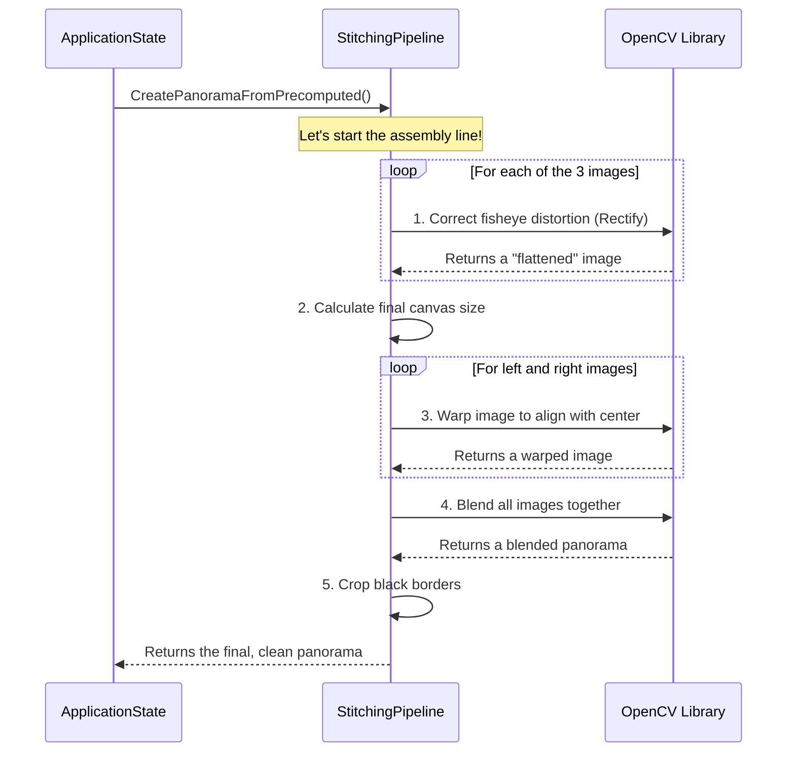

# Chapter 3: StitchingPipeline (C++)

In [Chapter 2: ApplicationState (GUI)](02_applicationstate__gui__.md), we explored the application's control panel. We learned how `ApplicationState` acts as a "conductor," taking user inputs from sliders and buttons and turning them into commands. But who actually performs the heavy lifting?

Meet the `StitchingPipeline`. If `ApplicationState` is the dashboard and steering wheel of our car, then `StitchingPipeline` is the powerful, high-performance engine under the hood. It's a C++ class designed for one purpose: to execute the image stitching process as fast and efficiently as possible.

### What's Our Goal?

Our goal is to understand how the application takes the raw ingredients—three separate camera images—and follows a recipe to cook up a final, seamless panorama.

The `StitchingPipeline` is like an automated photo-editing assistant. You give it:
1.  **Raw Photos:** The three images from our cameras (left, middle, right).
2.  **A "Prescription" (`buena.json`):** Instructions on how to correct the fisheye lens distortion for each camera. This was discussed in [Chapter 1: Offline Stitching & Calibration Script (Python)](01_offline_stitching___calibration_script__python__.md).
3.  **A "Blueprint" (`stereo_stitching_results.json`):** Instructions on how to align the corrected images.

The pipeline then carries out all the technical steps automatically, without any manual editing.

### The Core Idea: A Step-by-Step Assembly Line

The `StitchingPipeline` works like a factory assembly line. It takes raw materials at one end and pushes a finished product out the other, performing a specific sequence of operations along the way.

Here’s the recipe it follows:

1.  **Load Configuration:** Read the prescription (`intrinsics`) and blueprint (`extrinsics`) files.
2.  **Load Images:** Get the three raw camera images.
3.  **Execute Stitching:**
    *   Correct the lens distortion for all images.
    *   Calculate the size of the final panorama canvas.
    *   Warp (rotate and shift) the outer images to align with the center one.
    *   Blend the overlapping areas to hide the seams.
    *   Crop the result to remove any black borders.

Let's see how the `ApplicationState` class from the previous chapter uses this pipeline.

```cpp
// This happens inside ApplicationState in src/gui.cc

// 1. Create the engine
auto pipeline = std::make_unique<StitchingPipeline>();

// 2. Load the "prescription" and "blueprint" files
pipeline->LoadIntrinsicsData("buena.json");
pipeline->LoadExtrinsicsData("stereo_stitching_results.json");

// 3. Load the raw images
pipeline->LoadTestImages({"img_left.jpg", "img_mid.jpg", "img_right.jpg"});

// 4. Command the engine to build the panorama!
cv::Mat panorama = pipeline->CreatePanoramaFromPrecomputed();
```

As you can see, from the outside, the process is very straightforward. You load the necessary data and then call a single function to get the final result. All the complexity is hidden inside the `StitchingPipeline`.

### Under the Hood: The Assembly Line in Action

So what *really* happens inside that `CreatePanoramaFromPrecomputed()` call? Let's follow an image as it travels through the pipeline.



#### Step 1: Correcting the View (Rectification)

Just like in our Python script, the first step is to correct the "fisheye" effect. The pipeline uses the camera's prescription from `buena.json` to "remap" each pixel to its correct, undistorted position. This creates a clean, flat-looking image to work with.

```cpp
// Inside StitchingPipeline (src/stitching.cc)

cv::Mat StitchingPipeline::RectifyImageFisheye(const cv::Mat& image, ...) {
    cv::Mat rectified_image;
    // Uses pre-calculated maps to quickly remap the image
    cv::remap(image, rectified_image, map1, map2, cv::INTER_LINEAR);
    return rectified_image;
}
```
This process is pre-configured when `LoadIntrinsicsData` is called, making it very fast to execute for each new frame.

#### Step 2: Warping the Images into Place

Next, the pipeline needs to align the images. It uses the transformation "blueprint" from `stereo_stitching_results.json`. This blueprint is a matrix—a grid of numbers that tells the pipeline exactly how to rotate, scale, and move the left and right images so they line up perfectly with the middle image. This process is called a **perspective warp**.

```cpp
// Inside StitchingPipeline (src/stitching.cc)

// ... calculates the final_transform matrix ...
cv::Mat warped_image;
cv::warpPerspective(
    image_to_warp, 
    warped_image, 
    final_transform, 
    final_canvas_size
);
```
Imagine printing the left image onto a sheet of rubber and then stretching and rotating that sheet until its landmarks match up with the middle image. `warpPerspective` does exactly that, but with math.

#### Step 3: Blending the Seams

Now we have three images positioned correctly on a large canvas, but the overlaps are messy. The final step is to blend them. The simplest way, which our pipeline uses, is to take the brightest pixel value at each location where the images overlap. This creates a surprisingly effective and fast blend.

```cpp
// Inside StitchingPipeline (src/stitching.cc)

// Blend left and center images
cv::Mat panorama;
cv::max(warped_left_image, warped_center_image, panorama);

// Blend the result with the right image
cv::max(panorama, warped_right_image, panorama);
```

The final `panorama` variable now holds our complete, stitched image, ready to be displayed.

### CPU vs. GPU: The Need for More Speed

This C++ pipeline is much faster than the initial Python script, making it suitable for near real-time applications with our GUI. It uses the computer's main processor (the CPU) to perform all the calculations.

However, for high-resolution, high-framerate video, even this can be a bottleneck. CPUs are generalists; they're good at many things but not specialized in the kind of repetitive math needed for image processing.

That's where a Graphics Processing Unit (GPU) comes in. GPUs are designed to do thousands of simple calculations all at once (in parallel). In a future chapter, we will explore the **[CUDA Stitching Pipeline](07_cuda_stitching_pipeline.md)**, which offloads this entire assembly line to the GPU for a massive speed boost. This C++ pipeline serves as the fundamental logic and fallback for systems without a compatible GPU.

### Conclusion

You now understand the role of `StitchingPipeline`, the workhorse of our application. It's a highly-optimized C++ class that acts as an assembly line, taking in raw images and configuration files and executing a precise sequence of steps—rectification, warping, and blending—to produce a finished panorama.

It is the engine that the `ApplicationState` "dashboard" controls, cleanly separating the user interface logic from the heavy computational work.

So far, we've dealt with stitching single, static images. But our ultimate goal is real-time video! To do that, we need a way to grab frames from all three cameras at the exact same moment. How do we ensure our frames are perfectly synchronized?

That's the challenge we'll tackle in the next chapter.

**Next up:** [Chapter 4: SynchronizedCapture](04_synchronizedcapture_.md)

---

Generated by [AI Codebase Knowledge Builder](https://github.com/The-Pocket/Tutorial-Codebase-Knowledge)