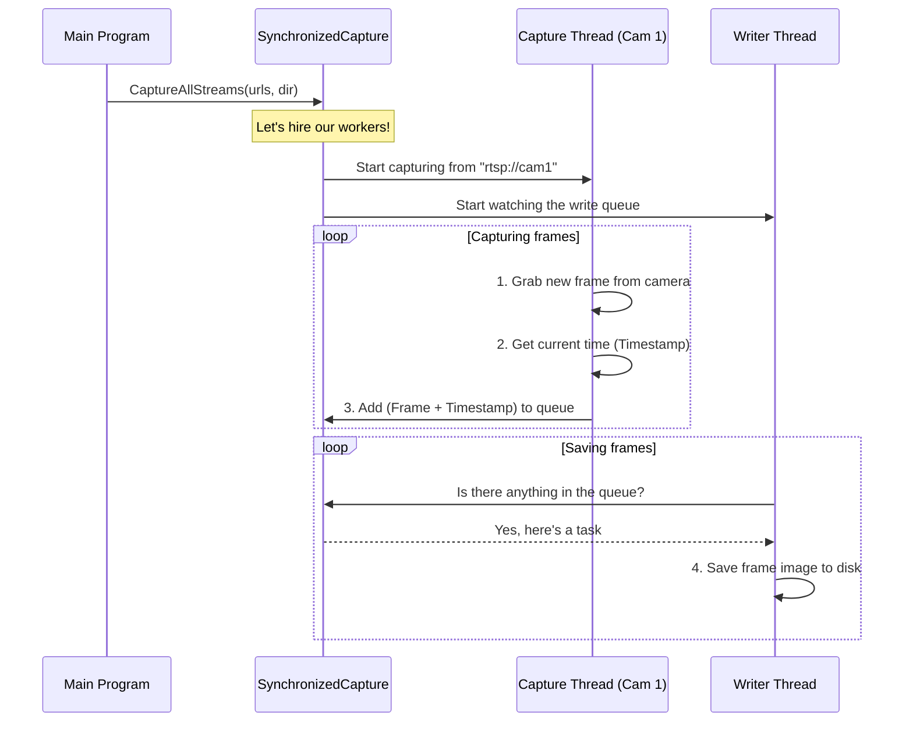

# Chapter 4: SynchronizedCapture

In the [Chapter 3: StitchingPipeline (C++)](03_stitchingpipeline__c____.md), we built a high-speed "engine" capable of stitching three static images into a beautiful panorama. That's great for photos, but our ultimate goal is to work with *live video*.

This presents a new, crucial challenge: how do we grab frames from three independent video streams at the *exact same moment*? If we don't, we'll get strange results. Imagine a person walking across the scene. If one camera captures them on the left while the other two are a split-second behind, our final panorama might show the person's legs trailing their body!

To solve this, we need a system that acts like a movie director shouting "Action!" to all camera operators at once. This is the job of `SynchronizedCapture`.

### What's Our Goal?

Our goal is to build a reliable system that can connect to three separate video camera streams (over a network using RTSP) and capture frames from each one. The most important part is that for every frame we capture, we must immediately attach a highly accurate timestamp.

Think of it like this:
*   We have three camera feeds, each producing a continuous stream of images.
*   The `SynchronizedCapture` system taps into all three streams.
*   For each frame it pulls from a camera, it looks at a high-precision clock and writes down the exact time: "Camera 2, Frame #58, captured at 14:32:05.123456789".
*   It then saves the image and this timestamp note (metadata) to the disk.

This process ensures that later on, we can sift through all the saved frames and find three (one from each camera) that were captured at the same precise moment in time.

### The Core Idea: Separate Jobs for Speed

Capturing a frame from a network stream is fast. Saving a file to a hard drive is slow. If we tried to do everything in one sequence (capture, save, capture, save...), the slow disk-writing step would cause us to miss frames from the video stream.

`SynchronizedCapture` solves this by creating two different teams of workers (threads):
1.  **Capture Threads:** A dedicated thread for each camera. Its only job is to grab a frame, timestamp it, and drop it into a "to-do" queue. This is a very fast operation.
2.  **Writer Threads:** A team of threads whose only job is to take frames from the "to-do" queue and save them to the disk.

By separating these tasks, the fast capture threads are never blocked by the slow writing threads. This allows us to capture frames at a very high rate without losing data.

### How to Use `SynchronizedCapture`

Using the system is straightforward. You create an instance of it, tell it which video streams to watch and where to save the files, and then let it run.

```cpp
// main.cc (simplified)
#include "synchronized_capture.hh"
#include <vector>
#include <string>

int main() {
    // 1. Create the capture system
    SynchronizedCapture capture_system;

    // 2. Define the camera streams and output folder
    std::vector<std::string> rtsp_urls = {"rtsp://cam1", "rtsp://cam2", "rtsp://cam3"};
    std::string output_dir = "./captured_data";

    // 3. Start capturing! This will run in the background.
    capture_system.CaptureAllStreams(rtsp_urls, output_dir);

    // ... let it run for a while ...
    std::cout << "Capturing... Press Enter to stop.\n";
    std::cin.get();
    
    // 4. Stop the capture and save all metadata
    capture_system.StopCapture();
    capture_system.SaveMetadata(output_dir);

    return 0;
}
```
When you run this code, `SynchronizedCapture` will create a set of directories and start filling them with images and data files, ready for the next stage of our pipeline.

### Under the Hood: A Look at the Workflow

Let's visualize how the different worker threads collaborate when `CaptureAllStreams()` is called.



This diagram shows the core principle: the `Capture Thread`'s only job is to quickly get data and queue it up. The `Writer Thread` handles the slow-saving process independently, ensuring the capture process is never delayed.

#### Step 1: Launching the Capture Threads

Inside `CaptureAllStreams`, the system creates a separate thread for each camera URL provided. Each thread runs the same function: `CaptureCamera`.

```cpp
// src/synchronized_capture.cc (Simplified)

bool SynchronizedCapture::CaptureAllStreams(...) {
    // ...
    // Start one capture thread for each camera
    for (int i = 0; i < 3; ++i) {
        capture_threads_.emplace_back(
            &SynchronizedCapture::CaptureCamera, this, i, rtsp_urls[i], ...
        );
    }
    // ... start writer threads ...
    return true;
}
```
This code spawns our dedicated workers, one for each camera feed.

#### Step 2: Capturing and Timestamping

The `CaptureCamera` function is the heart of the capture process. It runs in a tight loop, doing its job as quickly as possible.

```cpp
// src/synchronized_capture.cc (Simplified)

void SynchronizedCapture::CaptureCamera(int camera_id, ...) {
    cv::VideoCapture cap(rtsp_url); // Connect to camera

    while (!stop_requested_) {
        cv::Mat frame;
        // The most important moment: get the time *right before* grabbing!
        auto capture_time = std::chrono::high_resolution_clock::now();
        
        if (!cap.read(frame)) break; // Grab the frame

        // Queue the frame and its metadata for writing
        write_queue_.emplace(frame, /* filename */, capture_time, ...);
    }
}
```
The two most critical lines are `high_resolution_clock::now()` and `cap.read()`. By timestamping immediately before reading, we get a very accurate record of when the frame was available on the network stream.

#### Step 3: Writing to Disk Asynchronously

Meanwhile, the `AsyncFrameWriter` threads are running a different loop. They wait for tasks to appear in the `write_queue_`.

```cpp
// src/synchronized_capture.cc (Simplified)

void SynchronizedCapture::AsyncFrameWriter() {
    while (!stop_requested_ || !write_queue_.empty()) {
        WriteTask task;
        // Safely get a task from the shared queue
        // (This waits if the queue is empty)
        if (get_task_from_queue(&task)) {
            // This is the slow part, but it doesn't block capturing!
            cv::imwrite(task.filename, task.frame);
        }
    }
}
```
Because this writer thread is separate, the `imwrite` function—which can take a while—never slows down the `CaptureCamera` threads. This elegant design allows the system to handle high-frame-rate video streams without losing data.

### Conclusion

You now understand how `SynchronizedCapture` solves the critical problem of capturing frames from multiple video streams in a time-synced manner. It uses a multi-threaded producer-consumer pattern (capture threads "produce" work, writer threads "consume" it) to ensure high performance.

The output of this system is a collection of image files and, more importantly, a set of records detailing the precise capture time for each frame. But what does this "record" or "metadata" actually look like, and what information does it contain?

That brings us to our next chapter, where we'll examine the simple but powerful data structure that holds this vital information.

**Next up:** [Chapter 5: FrameMetadata](05_framemetadata_.md)

---

Generated by [AI Codebase Knowledge Builder](https://github.com/The-Pocket/Tutorial-Codebase-Knowledge)