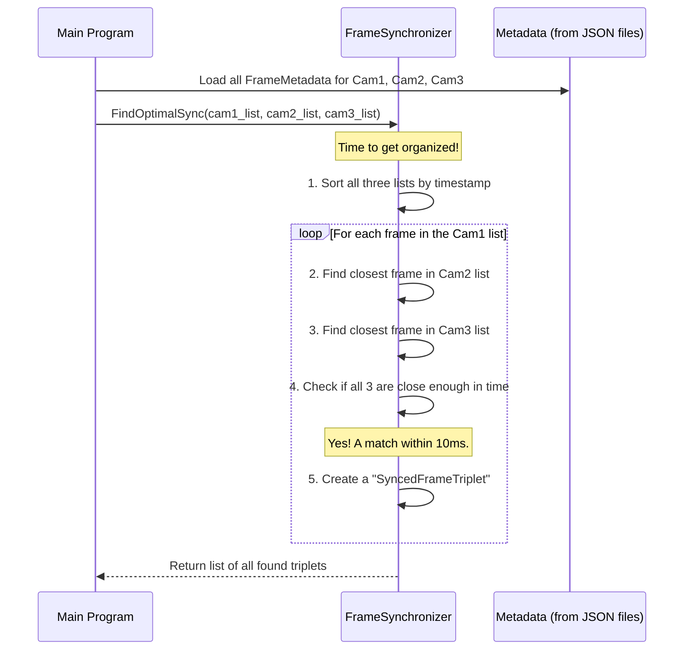

# Chapter 6: FrameSynchronizer

In [Chapter 5: FrameMetadata](05_framemetadata_.md), we learned how to attach a digital "label" to every frame we capture. Our [SynchronizedCapture](04_synchronizedcapture_.md) system diligently saved thousands of these labeled images into three separate folders, one for each camera.

We now face a new puzzle. We have three giant piles of photos, and each photo has a very precise timestamp. How do we sift through these piles to find sets of three—one from each camera—that were all taken at the exact same moment?

This is the job of the `FrameSynchronizer`. It acts like a meticulous film editor, scanning all the footage to find and group together shots that represent the same instant from different viewpoints.

### What's Our Goal?

Imagine you're trying to assemble a stop-motion animation using photos from three cameras. For each "frame" of your animation, you need to find the photo from Camera A, Camera B, and Camera C that were taken at the same time. Doing this by hand for thousands of images would be impossible!

Our goal is to build a program that does this automatically. It will take three long lists of `FrameMetadata` objects as input and produce a single, clean list of "synchronized triplets." Each triplet is a package containing the file paths to three images that are ready to be stitched together into one frame of our final panoramic video.

### The Core Idea: Matching Timestamps

The `FrameSynchronizer`'s strategy is simple but powerful: it uses the high-precision timestamps from the `FrameMetadata` objects.

1.  It receives three lists of metadata, one for each camera.
2.  It chooses one camera as the "reference" (e.g., Camera 1).
3.  It goes through every single frame from the reference camera.
4.  For a given reference frame, it asks: "What is the closest frame from Camera 2, in terms of time?" and "What is the closest frame from Camera 3?"
5.  If it finds two matching frames that are both within a tiny time window (e.g., a few milliseconds) of the reference frame, it declares them a "synchronized triplet" and saves them as a group.

This process turns three chaotic streams of frames into a single, ordered sequence of synchronized sets, ready for stitching.

### Under the Hood: The Synchronization Workflow

Let's see how `FrameSynchronizer` finds these triplets. The main program (`rtsp_stitcher.cc`) is responsible for loading the metadata from the JSON files and then passing it to the synchronizer.



This diagram shows the core logic. Sorting the lists first is the secret sauce that makes the process incredibly fast.

#### Step 1: Loading and Sorting the Data

Before we can find matches, we need to get our data in order. The first thing `FindOptimalSync` does is sort each camera's metadata list chronologically.

```cpp
// src/frame_synchronizer.cc (Simplified)

void FrameSynchronizer::SortFramesByTimestamp(std::vector<FrameMetadata>& frames) {
    // Sorts the list of frames from oldest to newest timestamp
    std::sort(frames.begin(), frames.end(),
        [](const FrameMetadata& a, const FrameMetadata& b) {
            return a.timestamp < b.timestamp;
        });
}
```
Imagine trying to find a specific date in a massive, unsorted pile of letters. It would take forever. But if the letters are sorted by date, you can find the one you need in seconds. Sorting our frames allows us to use very fast search algorithms.

#### Step 2: The Main Loop: Iterating and Matching

With the data sorted, the synchronizer loops through each frame of the reference camera (Camera 1) and tries to find partners for it in the other two lists.

```cpp
// src/frame_synchronizer.cc (Simplified)

// Loop through every frame from the reference camera
for (const auto& cam1_frame : cam1_filtered) {
    // Find the best match for this frame's time in the other lists
    auto cam2_match = FindClosestFrame(cam2_filtered, cam1_frame.timestamp, ...);
    auto cam3_match = FindClosestFrame(cam3_filtered, cam1_frame.timestamp, ...);
    
    // Did we find a match for both?
    if (cam2_match.has_value() && cam3_match.has_value()) {
        // Yes! Create a triplet object and add it to our results.
    }
}
```
This is the heart of the synchronizer. It systematically checks every potential moment in time for a valid three-camera match.

#### Step 3: Finding the Closest Frame Quickly

How does `FindClosestFrame` work? Since our lists are sorted, it can use a highly efficient algorithm called **binary search**. Instead of checking every frame, it can intelligently jump to the middle of the list and instantly narrow down the search space by half, repeating this process until it hones in on the target time.

```cpp
// src/frame_synchronizer.cc (Simplified concept)

std::optional<FrameMetadata> FrameSynchronizer::FindClosestFrame(
    const std::vector<FrameMetadata>& frames,
    /* ... time to search for ... */) {
    
    // Use binary search to jump to the right place in the sorted list
    auto it = std::lower_bound(frames.begin(), frames.end(), ...);

    // ... check the frame at 'it' and the one right before it ...
    // to see which one is truly the closest in time.

    // If the time difference is small enough, return the match.
}
```
This clever search method is what makes the `FrameSynchronizer` fast enough to process tens of thousands of frames in just a few seconds.

### The Output: A List of Stitching Jobs

After the `FrameSynchronizer` has finished its work, it returns a vector of `SyncedFrameTriplet` objects. Each object is a simple package containing everything needed for one stitching operation.

```cpp
// A simplified view of what a SyncedFrameTriplet contains
struct SyncedFrameTriplet {
    std::string cam1_path; // "output/raw_frames/cam1/00001234.png"
    std::string cam2_path; // "output/raw_frames/cam2/00001230.png"
    std::string cam3_path; // "output/raw_frames/cam3/00001238.png"
    // ... other info like a unique ID and the sync quality ...
};
```
This list is the final input for our video creation pipeline. Each triplet is a "to-do" item, telling the stitcher exactly which three images to combine to create the next frame of the final panoramic video.

### Conclusion

You now understand the crucial role of the `FrameSynchronizer`. It's the bridge between the raw, timestamped data from [Chapter 4: SynchronizedCapture](04_synchronizedcapture_.md) and the final stitching process. It acts as an intelligent editor, sifting through thousands of frames to find perfectly synchronized sets, or "triplets."

By sorting the data and using efficient search algorithms, it can perform this complex matching task very quickly. The output—a clean, ordered list of `SyncedFrameTriplet`s—is the perfect recipe for building our final video.

We have now assembled all the necessary ingredients: we have the blueprints for how to stitch, we have the synchronized sets of images, and we have a C++ engine that can perform the stitching. But for high-resolution video, can we make it even faster?

That brings us to our final chapter, where we'll unleash the full power of the GPU.

**Next up:** [Chapter 7: CUDA Stitching Pipeline](07_cuda_stitching_pipeline_.md)

---

Generated by [AI Codebase Knowledge Builder](https://github.com/The-Pocket/Tutorial-Codebase-Knowledge)