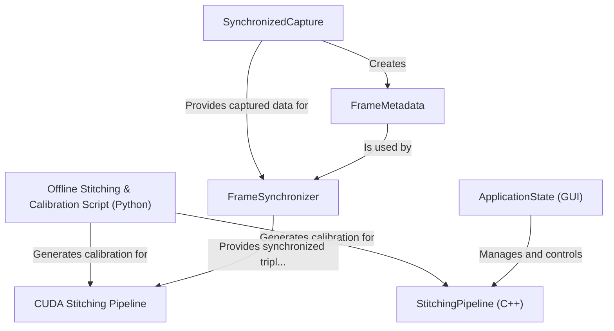

# Tutorial: stitchmrsl

This project **stitches** images from multiple cameras into a single, wide-angle *panoramic view*. It features an offline Python script for calculating camera calibration from images with special ArUco markers. The main application can then use this calibration to capture frames from live *RTSP video streams*, synchronize them precisely by their timestamps, and use a high-performance **GPU (CUDA) pipeline** to create a live, stitched video feed. A graphical user interface is also provided for interactive control and visualization.

**Source Repository:** [None](None)

## Chapters

1. [Offline Stitching & Calibration Script (Python)
](01_offline_stitching___calibration_script__python__.md)
2. [ApplicationState (GUI)
](02_applicationstate__gui__.md)
3. [StitchingPipeline (C++)
](03_stitchingpipeline__c____.md)
4. [SynchronizedCapture
](04_synchronizedcapture_.md)
5. [FrameMetadata
](05_framemetadata_.md)
6. [FrameSynchronizer
](06_framesynchronizer_.md)
7. [CUDA Stitching Pipeline
](07_cuda_stitching_pipeline_.md)

---

Generated by [AI Codebase Knowledge Builder](https://github.com/The-Pocket/Tutorial-Codebase-Knowledge)