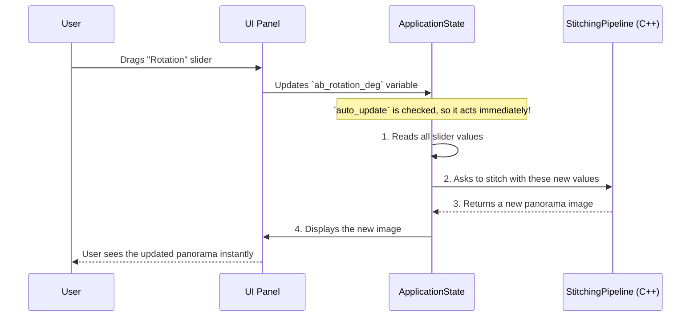

# Chapter 2: ApplicationState (GUI)

In [Chapter 1: Offline Stitching & Calibration Script (Python)](01_offline_stitching___calibration_script__python__.md), we acted like an architect, creating the "blueprints" (`stereo_stitching_results.json`) needed to stitch images together. That's fantastic for one-off tasks, but what if we want to build a real-time tool? What if we want to see the panorama live and fine-tune the alignment with sliders and buttons?

For that, we need a control panel. This chapter introduces the brain of our interactive tool: `ApplicationState`.

### From Blueprints to a Live Dashboard

Imagine the Python script from Chapter 1 built a powerful car engine. That engine knows how to do one thing very well: combine fuel and air to create power. But an engine by itself isn't very useful. You need a car around it—with a steering wheel, accelerator, and a dashboard—to actually control it and go somewhere.

`ApplicationState` is the dashboard and control system for our stitching engine. It's a C++ class that holds all the information about our application's current *state*, such as:
*   Which calibration files are we using?
*   Which images are loaded?
*   What is the current value of the "rotation" slider?
*   Is the "Enable Manual Adjustments" checkbox ticked?

It connects the user's actions in the graphical user interface (GUI) to the powerful C++ stitching engine, providing immediate visual feedback.

### The Core Idea: One Place for All Settings

The main job of `ApplicationState` is to be the single source of truth for the application's configuration. The GUI reads from it to display the correct values, and when you interact with the GUI, you are directly changing the variables inside `ApplicationState`.

Let's look at a simplified view of what `ApplicationState` holds.

```cpp
// A simplified view of the ApplicationState class
struct ApplicationState {
    // File paths from text boxes
    char intrinsics_file_path[256] = "buena.json";
    char extrinsics_file_path[256] = "stereo_stitching_results.json";

    // Checkbox state
    bool manual_adjustments_enabled = false;
    bool auto_update_enabled = true;

    // Slider values for tweaking the first stitch (A+B)
    float ab_rotation_deg = 0.80f;
    float ab_translation_x = -2.8f;
    
    // ... and many more for other sliders and settings ...
};
```
When you launch the GUI, you see a control panel. Every button, slider, and text box in this panel is directly linked to a variable in an `ApplicationState` object.


For example, when you drag the "AB Rotation" slider, you are changing the `ab_rotation_deg` variable in memory in real-time.

```cpp
// src/gui.cc
// This single line of code creates a slider in the UI and
// links it directly to our state variable.
ImGui::DragFloat("AB Rotation", &state.ab_rotation_deg, 0.01f);
```
This is the magic of the GUI library we use (ImGui). It makes it incredibly simple to link a visual widget to a variable.

### How `ApplicationState` Drives the Action

Okay, so we can change variables by moving sliders. How does that turn into a newly stitched image? This is the second major role of `ApplicationState`: **it translates user intent into action.**

When a variable changes (or you click a button like "Manual Update"), `ApplicationState` calls the appropriate functions on the underlying stitching engine. Let's trace the journey of a single user action.



This feedback loop is what makes the tool interactive. You're not just running a script and waiting for the output; you are sculpting the output in real-time.

### A Look Under the Hood

Let's peek at the code that makes this happen. When you enable manual adjustments and move a slider, a function called `UpdatePanoramaWithAdjustments` inside `ApplicationState` gets called.

#### Step 1: Read the Live Values from the State

The first thing the function does is read the current values of all the adjustment sliders from its own member variables.

```cpp
// src/gui.cc

void ApplicationState::UpdatePanoramaWithAdjustments() {
    // ...
    // Convert degrees from the slider to a value for math
    float ab_rad = ab_rotation_deg * CV_PI / 180.0f;
    
    // Read other slider values like scale and translation
    // float ab_cos = cos(ab_rad);
    // ...
}
```

#### Step 2: Build a New "Blueprint"

Using these values, it constructs a new transformation matrix on the fly. This is the same kind of mathematical "blueprint" we generated with the Python script in Chapter 1, but now we're creating it from our slider values instead of ArUco markers.

```cpp
// src/gui.cc (inside UpdatePanoramaWithAdjustments)

// Create a new, empty transformation matrix (blueprint)
cv::Mat ab_custom = cv::Mat::eye(3, 3, CV_64F);

// Fill it with data based on the slider values
ab_custom.at<double>(0, 0) = cos(ab_rad) * ab_scale_x;
ab_custom.at<double>(0, 2) = ab_translation_x;
// ... and so on for the rest of the matrix ...
```
This code creates a custom alignment recipe based on your exact slider settings.

#### Step 3: Command the Engine

Finally, `ApplicationState` passes these newly created blueprints to the high-speed C++ stitching engine, which is an object of the [StitchingPipeline (C++)](03_stitchingpipeline__c____.md) class.

```cpp
// src/gui.cc (inside UpdatePanoramaWithAdjustments)

// Tell the pipeline to create a panorama using our custom-made blueprints
stitched_mat = pipeline->CreatePanoramaWithCustomTransforms(ab_custom, bc_custom);
```

The pipeline does the heavy lifting of warping and blending the images and returns the final panorama. `ApplicationState` then takes this image and makes sure it's displayed in the "Panorama Viewer" window.

### Conclusion

You now understand the central role of `ApplicationState`. It's not just a dumb container for variables; it's the conductor of our application's orchestra. It listens to the user (via the GUI), holds the "sheet music" (the current settings), and directs the performers (the [StitchingPipeline (C++)](03_stitchingpipeline__c____.md)) to play in harmony.

This design cleanly separates three distinct jobs:
1.  **The GUI:** Responsible only for drawing widgets and reporting user interaction.
2.  **The `ApplicationState`:** The central coordinator that holds settings and translates user intent into commands.
3.  **The `StitchingPipeline`:** The workhorse that performs the complex, high-speed image processing.

Now that we know how the application is controlled, it's time to look at the engine itself. In the next chapter, we'll dive into the C++ workhorse that does all the heavy lifting.

**Next up:** [Chapter 3: StitchingPipeline (C++)](03_stitchingpipeline__c____.md)

---

Generated by [AI Codebase Knowledge Builder](https://github.com/The-Pocket/Tutorial-Codebase-Knowledge)