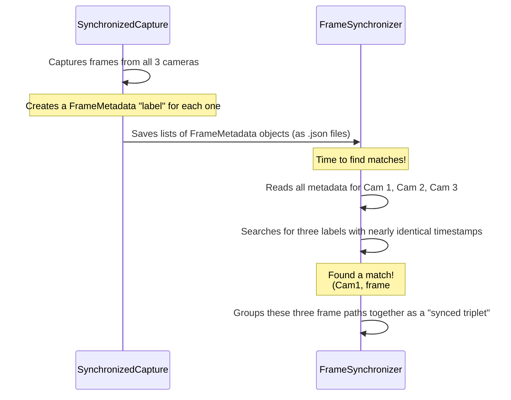

# Chapter 5: FrameMetadata

In the [Chapter 4: SynchronizedCapture](04_synchronizedcapture_.md), we built an amazing system that can capture frames from three video cameras at once. It works hard to save all these images to our disk, creating a big pile of `.png` files.

But this leads to a new puzzle: we have three folders full of thousands of images. How do we know which image from "cam1" corresponds to the same moment in time as an image from "cam2"? Without this information, we're lost. We need a label for every single frame.

This is where `FrameMetadata` comes in. It's the simple, yet absolutely vital, digital label that we attach to every single frame we capture.

### What's Our Goal?

Imagine you're a film director. Every time the camera rolls, an assistant holds up a clapperboard that shows the scene number, take number, and other key info. When the clapper snaps, it creates a visual and audio sync point for editors.

`FrameMetadata` is our digital clapperboard. For every image file, we need a corresponding piece of data that tells us everything we need to know about it.

Our goal is to understand this "digital label": what information it holds and why that information is the key to creating a perfectly synchronized video panorama.

### The Core Idea: A Digital Business Card for Every Frame

`FrameMetadata` is a simple C++ data structure (a `struct`). Think of it as a small "business card" attached to each image. It doesn't contain the image itself, but it holds all the essential information *about* the image.

Here's what's written on this business card:
*   **`frame_path`**: The file path to the actual image (e.g., `captured_data/raw_frames/cam1/00001234.png`).
*   **`camera_id`**: Which camera took this picture? (e.g., `0`, `1`, or `2`).
*   **`sequence_number`**: The unique frame number from that specific camera (e.g., this is the 1,234th frame from camera 1).
*   **`timestamp`**: This is the most crucial piece of information! It's a high-resolution, nanosecond-precision timestamp recording the exact moment the frame was captured.

The [SynchronizedCapture](04_synchronizedcapture_.md) system from the previous chapter is responsible for creating one of these `FrameMetadata` objects for every single frame it grabs.

### Under the Hood: The `FrameMetadata` Structure

The `FrameMetadata` structure is defined in C++ code. It's just a clean, organized way to group related variables together. It's not a complex piece of machinery; it's a simple container.

Here is a simplified look at its definition:

```cpp
// from synchronized_capture.hh

struct FrameMetadata {
    // The exact moment of capture
    std::chrono::high_resolution_clock::time_point timestamp;

    // Path to the saved image file
    std::string frame_path;

    // Which camera this frame came from (0, 1, or 2)
    int camera_id;

    // The sequential number for this frame from its camera
    uint64_t sequence_number;
};
```
This is it! It's a small, elegant structure that packs a lot of power. When our capture system runs, it creates thousands of these objects—one for each frame—and stores them.

### From Data to a File: Saving the Metadata

This data isn't useful if it just stays in memory. The `SynchronizedCapture` system also saves all these `FrameMetadata` objects to a `.json` file for each camera. This allows other programs (or later steps in our pipeline) to read them.

The system includes a handy function to convert a `FrameMetadata` object into JSON format.

```cpp
// from src/synchronized_capture.cc

json FrameMetadata::to_json() const {
    return json{
        {"timestamp",       /* nanosecond value */},
        {"sequence_number", sequence_number},
        {"frame_path",      frame_path},
        {"camera_id",       camera_id},
        // ... other info ...
    };
}
```
This code creates a JSON object that looks like this, which is easy for both humans and computers to read:
```json
{
  "camera_id": 0,
  "frame_path": "raw_frames/cam1/00001234.png",
  "sequence_number": 1234,
  "timestamp": 1670000012345678901
}
```

### The "Why": Enabling Synchronization

So, how does this simple label solve our big problem? It provides the raw material for our next component, the `FrameSynchronizer`, to work its magic.

Let's visualize the workflow. The `SynchronizedCapture` system produces frames and their metadata. Later, the `FrameSynchronizer` will read all this metadata to find matches.



The `FrameMetadata`, specifically the `timestamp`, is the key. It's the common thread that allows the `FrameSynchronizer` to look at three separate, chaotic lists of frames and correctly identify which three belong together in a single, synchronized moment of time.

### Conclusion

You now understand the role of `FrameMetadata`. It's not a complicated piece of software, but it's one of the most important concepts in our project. It acts as a digital clapperboard, providing a unique and detailed label for every frame captured by our system.

Without this crucial information—especially the high-resolution timestamp—we would have a disorganized pile of images. With it, we have an ordered dataset, ready for the next step: finding the perfect matches.

Now that we have all our frames neatly labeled, how do we build the tool that reads these labels and performs the matching? That's exactly what we'll cover in the next chapter.

**Next up:** [Chapter 6: FrameSynchronizer](06_framesynchronizer_.md)

---

Generated by [AI Codebase Knowledge Builder](https://github.com/The-Pocket/Tutorial-Codebase-Knowledge)