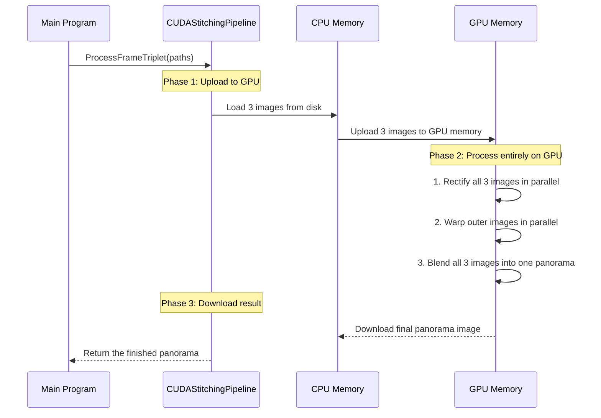

# Chapter 7: CUDA Stitching Pipeline

In the [Chapter 6: FrameSynchronizer](06_framesynchronizer_.md), we perfected our role as a film editor, creating a perfectly ordered list of "synchronized triplets." We now have everything we need to create our final panoramic video: the stitching blueprints from [Chapter 1: Offline Stitching & Calibration Script (Python)](01_offline_stitching___calibration_script__python__.md), the synchronized image sets, and the C++ engine from [Chapter 3: StitchingPipeline (C++)](03_stitchingpipeline__c____.md) to do the work.

But what if we need more speed? The C++ `StitchingPipeline` is fast, but for real-time, high-resolution video, it might struggle to keep up, like a workshop trying to meet the demands of a global factory. To achieve true video-rate performance, we need to move from the workshop to a full-blown industrial assembly line.

Welcome to the `CUDAStitchingPipeline`, the final and most powerful component in our toolkit.

### What's Our Goal?

Our goal is to perform the exact same stitching process—rectification, warping, and blending—but at lightning-fast speeds. We want to take our synchronized frame triplets and process them so quickly that we can generate a smooth, live panoramic video feed.

To do this, we're going to use a secret weapon: the **Graphics Processing Unit (GPU)**. While your computer's main brain, the CPU, is a brilliant generalist, a GPU is a specialist. It's designed to do thousands of simple, repetitive calculations all at the same time. This is called **parallel processing**, and it's perfect for image processing, where we often need to apply the same mathematical operation to millions of pixels at once.

The `CUDAStitchingPipeline` is a version of our stitching engine that has been re-engineered to run almost entirely on an NVIDIA GPU using a technology called CUDA.

### The Core Idea: The GPU Assembly Line

Think of the standard `StitchingPipeline` as a skilled artisan carefully crafting each panorama in their workshop. The `CUDAStitchingPipeline` is an automated, high-speed factory assembly line.

The process involves a key pattern:
1.  **Upload:** Move the three raw images from the computer's main memory (CPU) to the GPU's dedicated, high-speed memory.
2.  **Process on GPU:** Tell the GPU to perform all the heavy lifting—rectification, warping, and blending—using its thousands of cores. All intermediate results stay on the GPU.
3.  **Download:** Once the final panoramic image is ready, transfer just that one finished image from the GPU back to the CPU so it can be displayed or saved.

This "upload-process-download" cycle minimizes data traffic and lets the GPU do what it does best: process huge amounts of data in parallel.

### Under the Hood: The GPU Workflow

Let's see how our main application, `rtsp_stitcher.cc`, uses this supercharged pipeline to create our final video. Notice how similar it looks to using the regular pipeline. From the outside, it's designed to be a simple, powerful replacement.



This diagram shows the key concept: the slow, complex work happens entirely within the GPU's world, which is optimized for this task.

#### Step 1: Initialization and Calibration

Just like its CPU counterpart, the CUDA pipeline must first be initialized and loaded with our calibration data.

```cpp
// src/rtsp_stitcher.cc

// Create an instance of the CUDA pipeline
CUDAStitchingPipeline cuda_pipeline;

// Check for a CUDA-enabled GPU and allocate memory on it
cuda_pipeline.Initialize(input_frame_size);

// Load the same calibration files we've always used
cuda_pipeline.LoadCalibration("intrinsic.json", "extrinsic.json");
```
During initialization, the pipeline checks if a compatible NVIDIA GPU is available and prepares all the necessary memory and pre-computed "maps" on the GPU itself. This makes the processing of each new frame extremely fast.

#### Step 2: Processing a Frame Triplet

The main loop of our program feeds triplets of image paths to the `ProcessFrameTriplet` function. This one function call orchestrates the entire upload-process-download cycle.

```cpp
// src/rtsp_stitcher.cc

// Loop through all the synchronized sets we found
for (const auto& triplet : synchronized_frames) {
    // This one call does all the magic!
    cv::Mat panorama = cuda_pipeline.ProcessFrameTriplet(
        triplet.cam1_path,
        triplet.cam2_path,
        triplet.cam3_path
    );
    // 'panorama' is now a finished image, ready to be saved to our video file
    video_writer.write(panorama);
}
```
Inside this function, the magic happens. The pipeline uses OpenCV's special CUDA-enabled functions to perform each step.

#### Step 3: GPU-Accelerated Operations

Let's look at a simplified version of what happens inside `StitchImagesGPU` in `src/cuda_stitching_pipeline.cc`. Instead of using `cv::Mat` (for the CPU), we use `cv::cuda::GpuMat` (for the GPU).

```cpp
// src/cuda_stitching_pipeline.cc (Simplified)

// 1. Upload CPU images to GPU GpuMats
gpu_frame.upload(cpu_image);

// 2. Rectify the image using a GPU-accelerated function
// `gpu_map1` and `gpu_map2` are pre-loaded on the GPU
cv::cuda::remap(gpu_frame, gpu_rectified, gpu_map1, gpu_map2, ...);

// 3. Warp the image using a GPU-accelerated function
cv::cuda::warpPerspective(gpu_rectified, gpu_warped, transform, ...);

// 4. Blend images together using GPU-accelerated max()
cv::cuda::max(gpu_warped1, gpu_warped2, gpu_panorama);
```
Notice we aren't writing complex CUDA code ourselves. We are leveraging the powerful and highly optimized GPU modules provided by the OpenCV library. We simply tell OpenCV to perform these standard operations using data that lives on the GPU. The result is a massive performance boost.

### The Final Result: A High-Speed Video Factory

By offloading the heavy computational work to the GPU, the `CUDAStitchingPipeline` can process frame triplets much faster than the CPU-based pipeline. This allows our `rtsp_stitcher` application to generate a final panoramic video at high frame rates, turning our project from a photo-stitching tool into a real-time video processing system.

This CUDA pipeline is the final piece of our puzzle, representing the evolution from a simple Python prototype to a production-grade, high-performance C++ application.

### Conclusion: Our Journey is Complete!

And with that, you have seen every major component of the `stitchmrsl` project! Let's take a moment to look back at our journey:

1.  We started with a **[Python script](01_offline_stitching___calibration_script__python__.md)** to prove the concept and generate our essential calibration "blueprints."
2.  We built a GUI with **[ApplicationState](02_applicationstate__gui__.md)** to act as a control panel for our system.
3.  We created a fast **[C++ StitchingPipeline](03_stitchingpipeline__c____.md)** to serve as the main processing engine.
4.  To handle live video, we designed **[SynchronizedCapture](04_synchronizedcapture_.md)**, a system to grab frames from multiple cameras at once.
5.  We learned about **[FrameMetadata](05_framemetadata_.md)**, the crucial "digital labels" that make synchronization possible.
6.  We built the **[FrameSynchronizer](06_framesynchronizer_.md)**, an intelligent editor to find and group matching frames.
7.  Finally, we unleashed the full power of the GPU with the **CUDA Stitching Pipeline**, achieving the speed needed for real-time video.

You now have a complete, top-to-bottom understanding of how a complex, real-time video stitching system is built. You've seen how a project evolves from a simple script to a multi-stage, high-performance pipeline, with each component playing a clear and vital role. Congratulations

---

Generated by [AI Codebase Knowledge Builder](https://github.com/The-Pocket/Tutorial-Codebase-Knowledge)